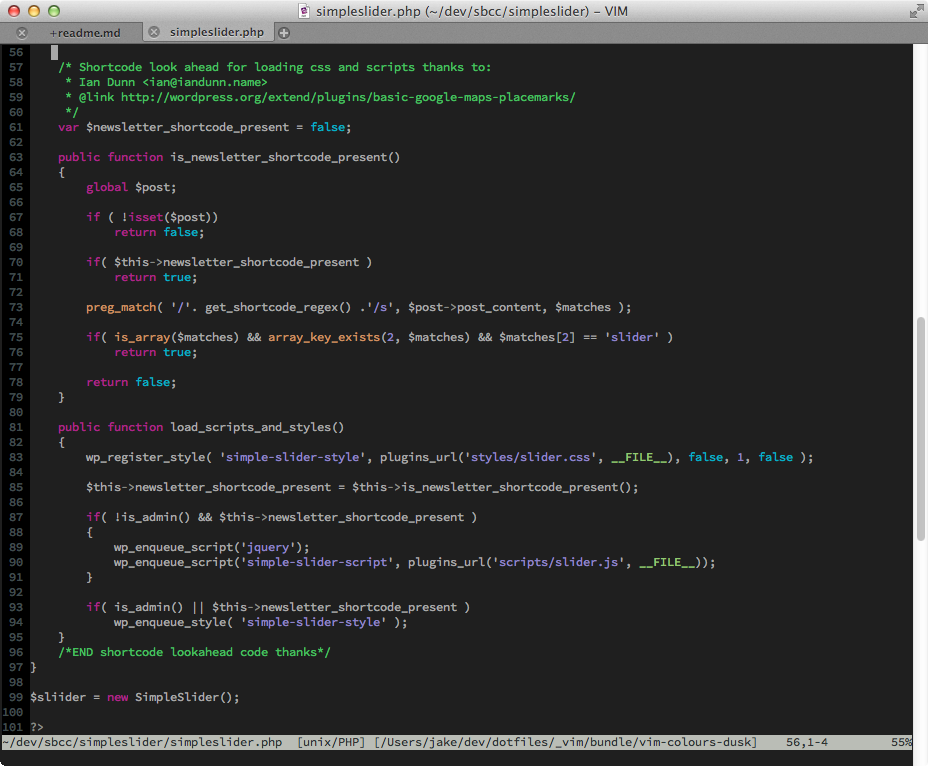

# Dusk Colour Scheme for Vim (GUI-only)

Those of you who use Xcode will possibly recognise this colour scheme. It is a
gui-only port of the awesome Dusk to Vim. It is the best available, as far as
I can tell. Some of the other ports are too bright. Dusk is meant to be
subdued and easy on the eyes, like the subdued and mellow light you get at
dusk.

## Screenshots

Because pictures speak thousands of words. 

## Installation and Usage

If you are using Tim Pope&rsquo;s
[Pathogen](https://github.com/tpope/vim-pathogen) to manage your Vim plugins,
then all you have to do is:

	cd ~/.vim/bundle 
	git clone git@github.com:jaapie/vim-colours-dusk vim-colours-dusk

If you have a dotfile repo and are using git and submodules like many other
sane people out there, then you probably know what to do and won&rsquo;t even
read this readme. Which is cool, I wouldn&rsquo;t either.

If you are not doing either, then download the zipball 
[here](https://github.com/jaapie/vim-colours-dusk/archive/master.zip) and
unzip it to your `~/.vim` directory, so:

	cd ~/Downloads
	unzip vim-colours-dusk-master.zip
	cd vim-colours-dusk-master
	cp -Rv ./colors ~/.vim

*Et Voila!* Next time you start Vim just type `:colorscheme Dusk` and you should
be blessed with all the dark-backgrounded pinky goodness of Dusk. If you are
like me and do not want to type `:colorscheme Dusk` every time you start Vim,
just put this into your `~/.vimrc` file:

	if has("gui_running")
		colorscheme Dusk 
	endif

Since this is a GUI-only port of Dusk for Xcode it makes no sense to apply the
colourscheme when you run Vim in a terminal. That&rsquo;s why the `colorscheme`
command is inside a conditional that tests if you have a GUI running.

## While You&rsquo;re Here&hellip;

WHy don&rsquo;t you check out my [dotfiles](/jaapie/dotfiles) repo which
includes a lot of Vim goodness.

## Credits

I want to thank the creator of the rdark colourscheme which is available
[here](http://www.vim.org/scripts/script.php?script_id=1732), Radu Dineiu
&mdash;which I highly recommend&mdash;becuase unbeknownst the him it enabled
me in its simplicity to create this colour scheme file.

The [HiLinkTrace](https://github.com/gerw/vim-HiLinkTrace) plugin helped heaps
when trying to figure out what highlight group I was trying to focus on.

